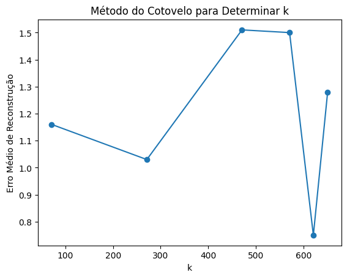
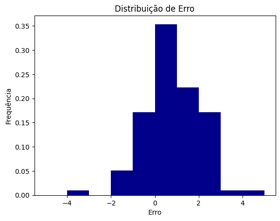
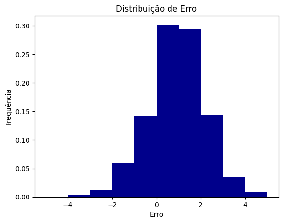

# O Desafio Netflix

## Introdução

O projeto consiste em um sistema preditor de nota de filmes por usuário, aplicando modelos matemáticos e gerando ao final, histogramas com o erro médio do sistema.

## Implementação

1. Certifique-se de ter o python instalado em seu computador; 
2. Clone esse repositório para algum lugar de sua máquina, utilizando o comando `https://github.com/insper-classroom/aps5-rafa-ribolla.git`; 
3. Instale as bibliotecas necessárias contidas no arquivo `requirements.txt`, através do comando: `pip install -r requirements.txt`.

## Organização

1. Código do projeto com 100 diferentes estimações em `teste_100.ipynb`; 
2. Código do projeto com 1000 diferentes estimações em `teste_1000.ipynb`; 
3. Arquivo `funcoes.py` para criação das funções: Sistema, Remoção e Previsão; 
4. Criação do arquivo `demo.py` para demonstração; 
5. Criação de um arquivo `requirements.txt` para instalação de bibliotecas; 
6. Pasta `graficos`contendo os gráficos de 100 estimações, 1000 estimações e valor de K; 
7. Arquivos `teste_100.ipynb` e `teste_1000.ipynb` separados, pois realizamos o segundo em um Google COLAB e portanto, achamos melhor deixar o cálculo do valor de K apenas no arquivo `teste_100.ipynb`;
8. Adição de comentários de explicação ao decorrer do código. 

## Arquivo Demo

1. Rode o arquivo `demo.py`; 
2. O arquivo gerará um histograma das distribuições de erro. 

## Tratamento de Dados

Antes de começarmos a criar o sistema de previsão de avaliações dos filmes por usuário foi necessário organizar as informações que possuíamos. Os dados para treinamento do nosso sistema foram baixados do site [Kaggle - The Movies Dataset](https://www.kaggle.com/datasets/rounakbanik/the-movies-dataset) e armazenados no arquivo `archive\ratings_small.csv`, arquivo que foi incluído no `.gitignore` e consequentemente não está nesse repositório dado seu tamanho. Colocamos os dados presentes no arquivo em um dataframe e selecionamos as colunas que nos interessavam (userId, movieId e rating). Então transformamos o dataframe em uma matriz de usúarios por filmes `(A_nan)` do tipo da biblioteca numpy, na qual os valores são as avaliações. Como nem todos os usuários avaliaram todos os filmes, algumas posições da matriz apresentavam como valor "NAN", para garantir o funcionamento do sistema de previsão, alteramos essas posições para o valor 2.5 que é o valor médio do intervalo das possíveis notas atreladas aos filmes.

## Funções, Modelo Matemático e SVD

### Sistema

A função `sistema(A, A_nan)` é responsável por gerar uma matriz (matriz B), na qual um dos usuário terá uma das suas reviews alteradas para um valor aleatório, criando assim uma matriz com ruído. Primeiro selecionamos uma posição na matriz `A_nan` que iniciou com um valor válido, ou seja, o filme foi avaliado pelo o usuário e portanto não possui como valor NAN. Assim, a partir dos índices `i` e `j` que represetam a posição selecionda, mudamos a mesma posição na matriz B (matriz com ruído), que é iniciada como uma cópia da matriz A (matriz original sem valores NAN). Concluindo, a função cria uma matriz com ruído baseada na matriz A.

### Remoção

Criamos uma função para remoção de ruídos e para isso, selecionamos os últimos K elementos de s, detentora dos valores singulares, pois ela indica a relevância de cada perfil e então, substituímos esses elementos por zero, para que peguemos apenas o número de autovalores mais relevantes, dado o valor de K encontrado.

### Previsão

A função de previsão é a que está concentrado a parte principal do nosso código. Primeiro decompomos nossa `matriz_com_ruido` usando a técnica de SVD (Singular Value Decomposition), ou seja, decompomos nossa matriz em 3 partes. A primeira é a Matriz de Transformação Ortogonal à Esquerda (U) que reprensenta a relação dos conceitos subjacentes(estilo dos filmes) com os dados, a segunda é a Matriz Diagonal que indica a relevância de cada perfil, e tem seus valores dispostos na diagonal da matriz e a última parte é a Matriz de Transformação Ortogonal à Direita. Usando a decomposição em SVD nós diminuímos a dimensonalidade dos dados e assim trabalhamos só com os autovetores (perfis) mais predominantes. Após isso nós aplicamos a função de `remocao(s, k)` (que foi explicada acima no subtópico "Remoção") então usamos a funçao `diagsvd(s_, u_.shape[1], vt_.shape[0])` com os valores singulares modificados para recriar nossa matriz diagonal. E por último usamos essa nova matriz diagonal para reconstruir a matriz original, ao realizar a multiplicação matricial dela com as matrizes `u_` e `vt_` e arredondamos os valores para uma casa decimal para facilitar a análise dos resultados.

## Melhor valor de K

Realizado no arquivo `teste_100.ipynb`

O nosso K representa a diferença entre a quantidade total de autovalores e o número de autovalores escolhidos. Para encontramos o nosso valor ideal de K, testamos 6 valores de K diferentes, sendo eles: `[A_nan.shape[0]-600, A_nan.shape[0]-400, A_nan.shape[0]-200, A_nan.shape[0]-100, A_nan.shape[0]-50, A_nan.shape[0]-20]`, sendo que o total era 671(`A_nan.shape[0]`), os valores testados foram, respectivamente, 71, 271, 471, 571, 621 e 651. Para o teste, calculamos a previsão (demonstrada no subtítulo "Previsão") e fizemos a diferença absoluta entre o valor correto e o valor predicado, testando 10 vezes para cada valor de K. Ao final, encontramos a média entre esses valores de cada K e fizemos o gráfico abaixo:

Através do gráfico fornecido e da tabela abaixo, foi possível escolher o valor de K ideal, sendo 621.

Valor de K | Nº de Autovalores | Erro médio |
 --- | --- | --- |
71 | 600 | 1.16 |
271 | 400 | 1.02 |
471 | 200 | 1.51 |
571 | 100 | 1.50 |
621 | 50 | 0.75 |
651 | 20 | 1.28 |

Valores do Erro Médio aproximados para duas casas decimais.

## Histograma

Ao final, fizemos o histograma da nossa Distribuição de Erros, tanto para o teste com 100 estimações, encontrado em `teste_100.ipynb`, tanto para 1000 estimações, encontrado em `teste_1000.ipynb` e  para isso, definimos nosso K como 621, criamos uma lista com nossos futuros resultados e assim como feito para encontrarmos nosso K ideal, calculamos a previsão e fizemos a diferença entre o valor correto e o valor predicado, porém deixando a diferença positiva e negativa. Em seguida, calculamos o Erro Médio para cada grupo de estimações com `K=621`, exposto na tabela abaixo:

Estimações | Erro Médio | 
--- | --- | 
10 | 0.75 |
100 | 1.15 |
1000 | 1.25 |

Para os histogramas, definimos o eixo x para cada erro (entre -5 e 5) e o eixo y para mostrar a frequência, em porcentagem das ocorrências de cada valor de erro, obtendo os gráficos abaixo:

## 100 Estimações

## 1000 Estimações

## Conclusão

Por fim, foi possível o desenvolvimento de um sistema de previsão de avaliações, além de um arquivo `demo.py` para a geração automática de um histograma com 1000 estimações. Logo, dado que, como evidenciado nos gráficos de distribuição de erro (com 100 estimações e com 1000 estimações), cerca de 30 a 35% do valor calculado pelo sistema é o mesmo em relação ao original ou se aproxima em casas decimais para cima, além de obter e um erro médio próximo a 1, o grupo acredita que o sistema poderia ser usado em produção.

## Referências

1. Código desenvolvido com o auxílio do [Notebook](https://github.com/mfstabile/AlgLin24-1) realizado pelo professor [Marcio Fernando Stabile Junior](https://github.com/mfstabile);
2. Amparo do NINJA [João Lucas Cadorniga](https://github.com/JoaoLucasMBC);
3. Auxílio do [ChatGPT](https://chat.openai.com/) para saciar dúvidas relacionadas ao projeto;
4. Consulta à [biblioteca do matplotlib](https://matplotlib.org/stable/gallery/color/named_colors.html) para pesquisa de cores para o gráfico.

## Desenvolvedores

Projeto desenvolvido por Gustavo Colombi Ribolla e Rafaela Afférri de Oliveira.